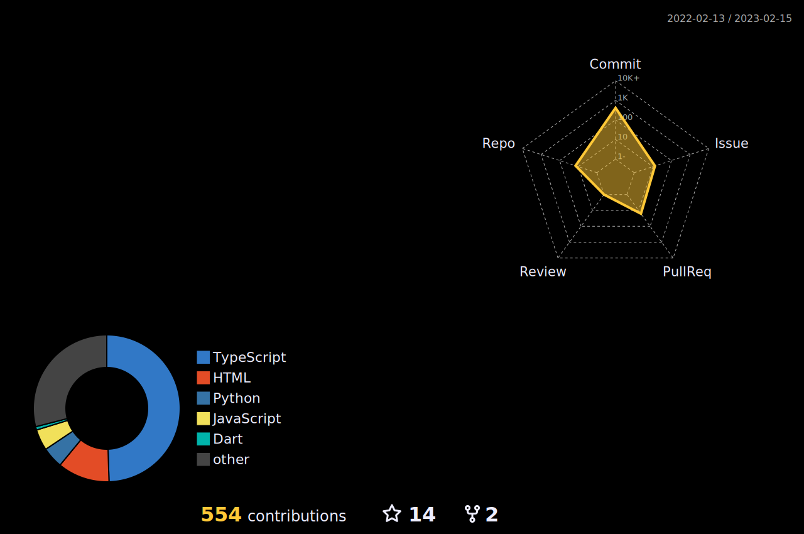

# Hi there👋

[](https://github.com/HRTK92)
[](https://github.com/HRTK92)

[](https://discord.com/users/618332297275375636)
[](https://wakatime.com/@a5982a45-0a0b-4188-88f9-ac9be4d26133)

## The site I made

[](https://github.com/HRTK92/LINE-Log-Viewer)
[](https://github.com/HRTK92/Youtube-De-Intro)
[](https://github.com/HRTK92/badminton-tool)


[links](https://hrtk92.vercel.app/links)

## My Stats

[](https://github.com/ryo-ma/github-profile-trophy)

[](https://github.com/yoshi389111/github-profile-3d-contrib)

<!--START_SECTION:waka-->
```text
HTML         1 hr 38 mins    ███████████████▓░░░░░░░░░   62.00 % 
Markdown     30 mins         █████░░░░░░░░░░░░░░░░░░░░   19.40 % 
TypeScript   12 mins         ██░░░░░░░░░░░░░░░░░░░░░░░   07.97 % 
JavaScript   5 mins          ▓░░░░░░░░░░░░░░░░░░░░░░░░   03.32 % 
Text         5 mins          ▓░░░░░░░░░░░░░░░░░░░░░░░░   03.21 % 
```
<!--END_SECTION:waka-->

[](https://github.com/HRTK92)

### Languages

- Python
- JavaScript
- TypeScript
