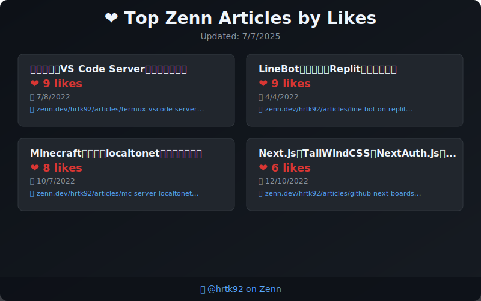

# Hi, I'm HRTK92! 👋

Nice to meet you! I'm a high school student in Japan.
I'm passionate about developing with TypeScript, Flutter, and Next.js.
I'm also interested in contributing to open source!

- 🎓 Student (Japan)
- 🌱 Currently learning: TypeScript, Flutter, Next.js
- 📫 How to reach me: [Discord](https://discord.com/users/618332297275375636)
- 📝 I'm writing articles on Zenn: [zenn.dev/hrtk92](https://zenn.dev/hrtk92)

---

## 🛠️ Skills

### Languages

### Frameworks & Libraries

### Others

---

## 📊 Activity

<!-- Copy-paste in your Readme.md file -->

<a href="https://next.ossinsight.io/widgets/official/compose-user-dashboard-stats?user_id=70054655" target="_blank" style="display: block" align="center">
  <picture>
    <source media="(prefers-color-scheme: dark)" srcset="https://next.ossinsight.io/widgets/official/compose-user-dashboard-stats/thumbnail.png?user_id=70054655&image_size=auto&color_scheme=dark" width="771" height="auto">
    
  </picture>
</a>

<!-- Made with [OSS Insight](https://ossinsight.io/) -->

---

## 📝 Latest Zenn Articles

<!-- feed start -->
-  [ConoHaをDiscordから起動したい](https://zenn.dev/hrtk92/articles/conoha-bot-for-ark?utm_source=github)
-  [Next.jsとTailWindCSS、NextAuth.js、Prismaを使用した掲示板](https://zenn.dev/hrtk92/articles/github-next-boards?utm_source=github)
-  [Minecraft統合版をlocaltonetで公開してみた](https://zenn.dev/hrtk92/articles/mc-server-localtonet?utm_source=github)
-  [スマホで「VS Code Server」を建てる方法](https://zenn.dev/hrtk92/articles/termux-vscode-server?utm_source=github)
-  [LineBotをスマホとReplitで作ってみる](https://zenn.dev/hrtk92/articles/line-bot-on-replit?utm_source=github)
<!-- feed end -->