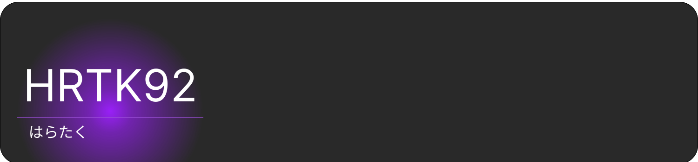

# 

## My Stats

 <!--START_SECTION:lapras-card-->
<a href="https://lapras.com/public/hrtk92" target="_blank" rel="noopener noreferrer"></a>
<!--END_SECTION:lapras-card-->

## Languages and Tools

[](https://code.visualstudio.com/)
[](https://git-scm.com/)
[](https://giyhub.com)
[](https://vercel.com/)
[](https://deno.com/)
[](https://www.heroku.com/)
[](https://www.netlify.com/)
[](https://firebase.google.com/)

[](https://www.djangoproject.com/)
[](https://reactjs.org/)
[](https://nextjs.org/)
[](https://flutter.dev/)
[](https://tailwindcss.com/)
[](https://www.mongodb.com/)

[](https://www.python.org/)
[](https://www.javascript.com/)
[](https://www.typescriptlang.org/)
[](https://deno.land/)
[](https://dart.dev/)
[](https://html.spec.whatwg.org/)
[](https://www.w3.org/Style/CSS/Overview.en.html)

## Metrics [](https://wakatime.com/@a5982a45-0a0b-4188-88f9-ac9be4d26133)
<!--START_SECTION:waka-->

```text
From: 21 February 2021 - To: 31 December 2022

TypeScript       173 hrs 37 mins ██████████████▒░░░░░░░░░░   57.78 %
HTML             22 hrs 18 mins  ██░░░░░░░░░░░░░░░░░░░░░░░   07.42 %
JavaScript       21 hrs 17 mins  █▓░░░░░░░░░░░░░░░░░░░░░░░   07.09 %
Python           19 hrs 3 mins   █▓░░░░░░░░░░░░░░░░░░░░░░░   06.34 %
Other            13 hrs 23 mins  █░░░░░░░░░░░░░░░░░░░░░░░░   04.46 %
```

<!--END_SECTION:waka-->

## Recent [Posts](https://github.com/HRTK92/zenn.dev) [](https://zenn.dev/hrtk92)

<!-- feed start -->
- 12月 10日 - [Next.jsとTailWindCSS、NextAuth.js、Prismaを使用した掲示板](https://zenn.dev/hrtk92/articles/github-next-boards?utm_source=github)
- 10月 26日 - [Replitのモバイルアプリがリリースされた！](https://zenn.dev/hrtk92/articles/replit-mobile-app?utm_source=github)
- 10月 7日 - [Minecraft統合版をlocaltonetで公開してみた](https://zenn.dev/hrtk92/articles/mc-server-localtonet?utm_source=github)
- 7月 8日 - [スマホで「VS Code Server」を建てる方法](https://zenn.dev/hrtk92/articles/termux-vscode-server?utm_source=github)
- 4月 4日 - [LineBotをスマホとReplitで作ってみる](https://zenn.dev/hrtk92/articles/line-bot-on-replit?utm_source=github)
<!-- feed end -->
<details>
<summary>More...</summary>

[](https://zenn.dev/hrtk92)

</details>

## Social

[](https://twitter.com/hrtk92)
[](https://zenn.dev/hrtk92)
[](https://github.com/HRTK92)
[](https://discord.com/users/618332297275375636)
